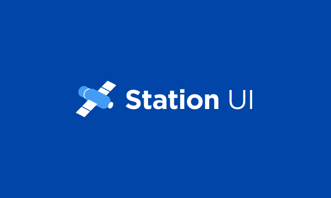

# Station UI



**Station UI** is a component library to serve [Station Web](https://github.com/terra-money/station) and [Station Extension](https://github.com/terra-money/station-extension).

## Local Storybook

This library uses [Storybook](https://storybook.js.org/) for local testing and development of components.

To use Storybook:

1. Install the dependencies:

```bash
npm install
```

2. Start the Storybook server:

```
npm run storybook
```

## Building the Package
```
npm run build
```
This will first run `npm run build-dictionary` to generate CSS tokens.
Then it will build the package and output it to `dist/`.

## Style Dictionary
This library uses [Style Dictionary](https://amzn.github.io/style-dictionary/#/) to generate CSS tokens.

To generate CSS tokens:
```
npm run build-dictionary
```
This will output the tokens to `src/styles/variables.css`.

Any change make to the JSON in `/style-dictionary/tokens/` will need `npm run build-dictionary` to update the changes.

## Linking the built package
To test the package locally, you can link the package to your project.

1. Build the package:
```
npm run build
```
2. Link the package:
```
npm link
```
3. In your project, link the package:
```
npm link station-ui
```
4. Add the station-ui stylesheet to your project (likely in `src/index.tsx`):
```
import 'station-ui/dist/style.css';
```
5. Import the package:
```
import { Button } from 'station-ui';
```
